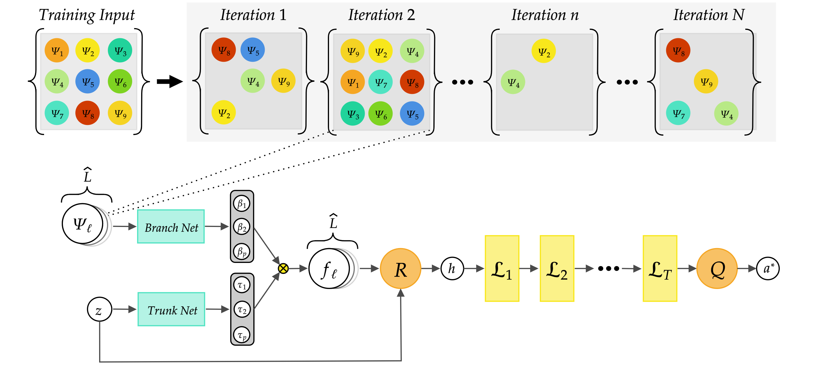

### What I added:
I cleaned up the entire repo structure, and to facilitate the new directory structure, added
`setuptools`.
To set everything up, on MacOS/Linux, run:
```
python -m venv ./venv
source ./venv/bin/activate
pip install -e .
```
(You may need to upgrade `pip`.)

Important files:
- `data/utils/modify_farfield.py`
    - we use this to process our farfield dataset into the shape that NIO will accept
- `src/core/nio/helmholtz.py`     
    - unmodified from original authors code, but we use their NIO architecture
- `src/datasets/BornFarField.py`
    - we transform our modified .hdf5 file into a Pytorch dataset that NIO will accept
- `src/utils/Baselines.py`
    - see the EncoderHelm class. this is a hardcoded network, which we may try to tune for our purposes
- `src/visualization/evaluate_trained_helmholtz.py`
    - specify an trained model.pkl, and it will generate some predictions vs. true images, and give some relevant statistics for our model
- `RunNio.py`
    - primary training loop
- `run_nio_config.py`
    - manually set hyperparameters here if you are running `RunNio.py` manually

Also see the `model_selection` folder. This is the original authors hyperparameter grid search code. We may use it, although it may be much simpler to just write our own grid search.

My GPU doesn't use slurm, so I ran 

```nohup python3 RunNio.py born_farfield_run1 born_farfield nio 2 > output.log 2>&1 &```

to train the model contained in `born_farfield_run1/`,
where
- `born_farfield_run1` specifies the output directory of artifacts from the model training
- `nio` is the architecture we use (we do not want to change this)
- `2` is the number of GPUs available on your machine
- `output.log` is where stdout gets dumped. (fair warning, because we use `tqdm` this file gets pretty big)

If you are using slurm you may have to write your own sbatch script.
Below is the authors original `README.md`.

### Neural Inverse Operators for solving PDE Inverse Problems
This repository is the official implementation of the paper [**Neural Inverse Operators for solving PDE Inverse Problems**](https://openreview.net/pdf?id=S4fEjmWg4X)

<br/><br/>



<br/><br/>

#### Requirements
YOU CAN DO THIS BUT `pip install -e .` DOES THIS FOR YOU.

The code is based on python 3 (version 3.7) and the packages required can be installed with
```
python3 -m pip install -r requirements.txt
```
#### Source Data
We cover instances of the Poisson, Helmholtz and Radiative Transport equations.
Data can be downloaded from https://zenodo.org/record/7566430 (14GB).
Alternatively, run the script `download_data.py` which downloads all required data into the appropriate folder (it requires 'wget' to be installed on your system).
```
python3 download_data.py
```
The data for the Seismic Imaging problem can be downloaded at: https://openfwi-lanl.github.io/docs/data.html#vel. 
Then, the h5 file required to run the code can be built by running: `GetStyleData.py` and `GetCurveData.py`

#### Models Training
Each of the benchmarks described in tha peper can be trained by running the python scripts `TrainNio.py`.
In order to ba able to run the script, the following arguments have to be added (in the order):
- name of the folder where to save the results
- flag for the problem 
- flag for the model
- number of workers (usually 0, 1, or 2)

The flag for the problem must be one among:
- `sine` for the Caldéron problem with trigonometric coefficients 
- `eit` for the Caldéron problem with Heart&Lungs
- `helm` for the inverse wave scattering
- `rad` for the radiative transfer problem
- `curve` for the seismic imaging with the CurveVel-A dataset
- `style` for the seismic imaging with the CurveVel-A dataset

The flag for the problem must be one among:
- `nio_new` for NIO
- `fcnn` for Fully Convolutional NN
- `don` for DeepONet

For instance:
```
python3 RunNio.py Example helm nio_new 0

```
Note: The authors say you should use the `nio_new` flag but based on what I've read in their code, `nio` should be the correct argument.

The models' hyperparameter can be specified in the corresponding python scripts as well.
To train the InversionNet model (the fully convolutional network baseline for Seismic Imaging) please refer to the GitHub page of Deng et Al (https://arxiv.org/pdf/2111.02926.pdf): https://github.com/lanl/OpenFWI

#### Hyperparameters Grid/Random Search
Cross validation for each model can be run with:

```
python3 ModelSelectionNIO.py model which
```

`which` and `model` must be one of the problems and models above.
For examples 
```
python3 ModelSelectionNIO.py nio_new helm
```
For the Seismic Imaging problem, only NIO and DON models can be run.

The hyperparameters of the models in the Table 1 have been obtained in this way.

The best performing configuration can be obtained by visualizing the results with tensorboard:
```
tensorboard --logdir=NameOfTheModelSelectionFolder
```

If a SLURM remote server is available set `sbatch=True` and `cluster="true"` in the script.

#### Pretrained Models
The models trained and used to compute the errors in Table 1 can be downloaded (9GB) by running:
```
python3 download_models.py
```
*Remark*: the compressed folder has to be unzipped!

#### Error Computations
The errors of the best performing models (Table 1) can be computed by running the script `ComputeNoiseErrors.py`.
It will compute the testing error for all the benchmark, for all the models and for different noise levels (Table 6).


